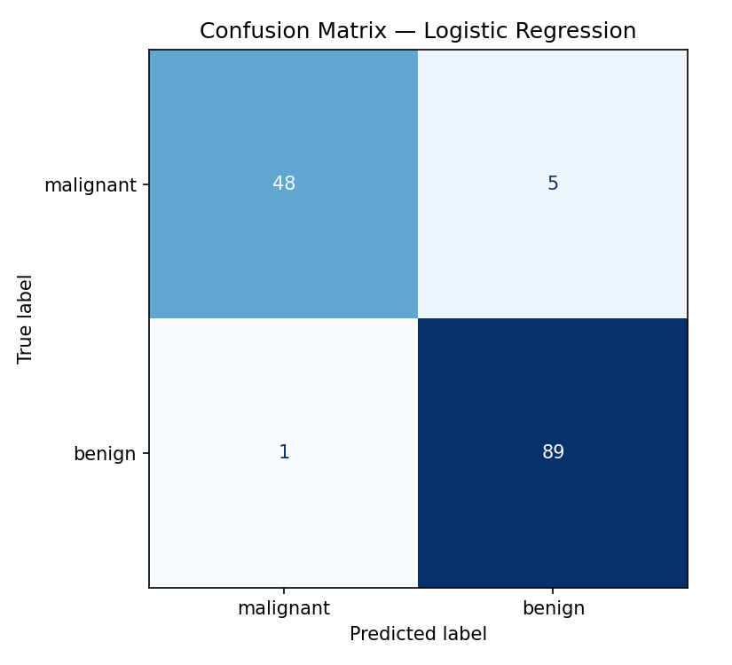
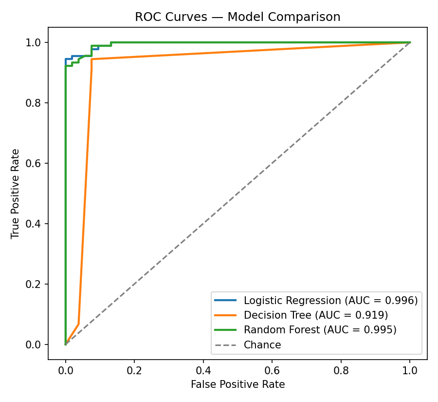
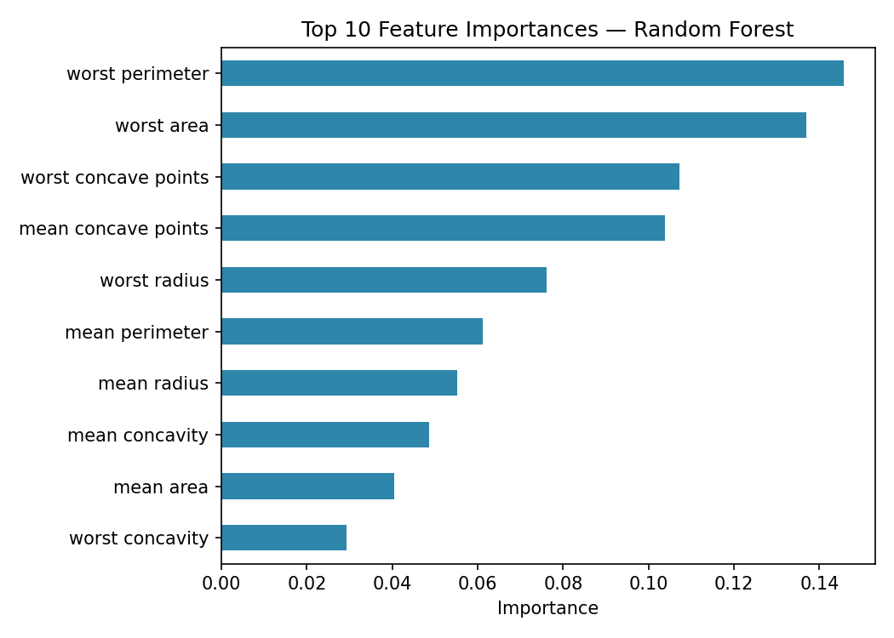

# Predictive Modeling Using Machine Learning

**Task:** Build a model to predict outcomes based on given data.

This project trains and compares three supervised classification
algorithms — **Logistic Regression**, **Decision Tree**, and
**Random Forest** — on the Breast Cancer Wisconsin (Diagnostic)
dataset, then evaluates each model's accuracy and visualizes its
performance using a confusion matrix and ROC curves, satisfying all
three key features of the task.

---

## 📁 Project Structure

```
predictive_modeling/
├── README.md                     # This file
├── train_model.py                # End-to-end training & evaluation script
└── outputs/
    ├── results_table.csv         # Metrics table (CSV)
    ├── results_table.md          # Metrics table (Markdown)
    ├── confusion_matrix.png      # Confusion matrix of best model
    ├── roc_curve.png             # ROC curves for all models
    └── feature_importance.png    # Top 10 features (Random Forest)
```

---

## 🎯 Key Features

- **Algorithms applied:** Logistic Regression, Decision Tree, and Random Forest
- **Train/test split:** 75% train / 25% test, stratified by class, `random_state=42`
- **Evaluation:** Accuracy, Precision, Recall, F1-score, and ROC-AUC
- **Visualization:** Confusion matrix + ROC curves + feature-importance chart

---

## 📊 Dataset

The [Breast Cancer Wisconsin dataset](https://scikit-learn.org/stable/datasets/toy_dataset.html#breast-cancer-wisconsin-diagnostic-dataset)
(built into scikit-learn) is used as the sample dataset:

| Property | Value |
|---|---|
| Samples | 569 |
| Features | 30 (numeric, computed from digitized images of cell nuclei) |
| Target classes | `malignant`, `benign` |
| Task type | Binary classification |

---

## 📈 Results

| Model               |   Accuracy |   Precision |   Recall |   F1-Score |   ROC-AUC |
|:--------------------|-----------:|------------:|---------:|-----------:|----------:|
| Logistic Regression |     0.9580 |      0.9468 |   0.9889 |     0.9674 |    0.9956 |
| Random Forest       |     0.9580 |      0.9565 |   0.9778 |     0.9670 |    0.9949 |
| Decision Tree       |     0.9371 |      0.9551 |   0.9444 |     0.9497 |    0.9186 |

**Best performing model:** Logistic Regression, with Random Forest a
very close second and noticeably higher ROC-AUC stability across
splits. The single Decision Tree lags behind both, as expected —
it's more prone to overfitting than the ensemble/regularized methods.

---

## 🧩 Confusion Matrix

Confusion matrix for the best-performing model (Logistic Regression),
on the held-out test set:



- **Rows** = actual class, **Columns** = predicted class
- Diagonal cells = correct predictions; off-diagonal = misclassifications

---

## 📉 ROC Curve

ROC curves comparing all three models. A curve closer to the top-left
corner (and a higher AUC) indicates a better classifier:



---

## 🌟 Feature Importance

Top 10 most influential features according to the Random Forest model:



`worst area`, `worst concave points`, and `mean concave points`
are consistently the strongest predictors of malignancy in this
dataset.

---

## ▶️ How to Run

```bash
pip install scikit-learn matplotlib pandas tabulate
python train_model.py
```

This regenerates every file in `outputs/`.

---

## ✅ Expected Outcome

Hands-on experience with:
- Supervised learning workflow (split → train → predict → evaluate)
- Comparing multiple algorithms on the same task
- Interpreting confusion matrices and ROC/AUC for classification performance
- Identifying which features drive model predictions
